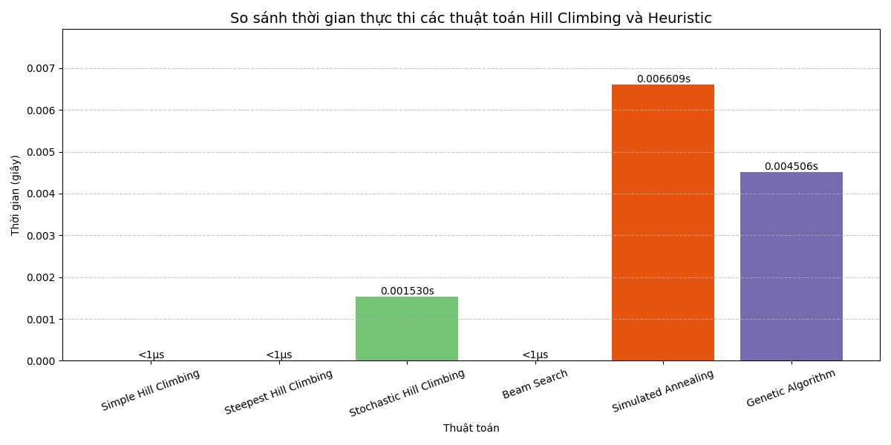
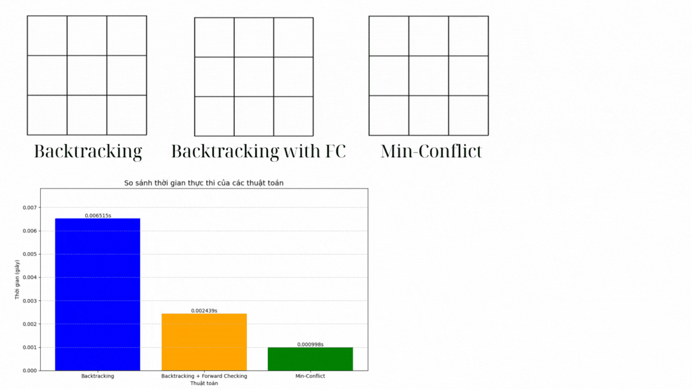

# Báo cáo cơ bản

## 1. Mục tiêu

## 2. Nội dung

### 2.1. Các thuật toán Tìm kiếm không có thông tin

- Trình bày các thành phần chính của bài toán tìm kiếm là gì? Và solution là gì?
- Hình ảnh gif của từng thuật toán khi áp dụng lên trò chơi:
  
  

- Hình ảnh so sánh hiệu suất của các thuật toán:

  *(Thêm gif nếu có)*

- Một vài nhận xét về hiệu suất của các thuật toán trong nhóm này khi áp dụng lên trò chơi 8 ô chữ (nếu có)

### 2.2. Các thuật toán Tìm kiếm có thông tin

  

### 2.3. Local Search

  
  
### 2.4. Constraint Satisfaction Problems (CSPs)

  
