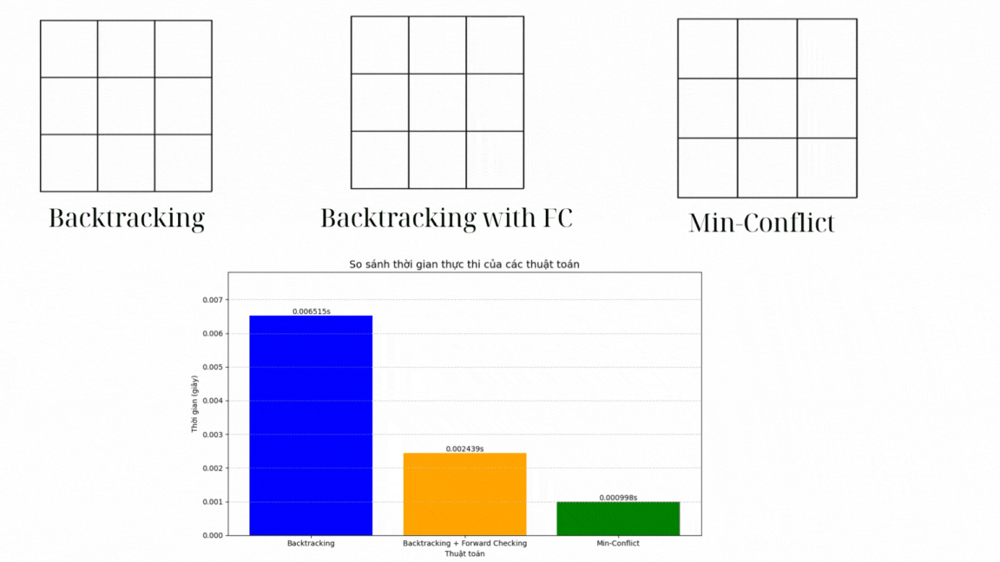

# Bài tập Cá nhân AI
## Bùi Quốc Hậu-23110211
##    Giới thiệu bài toán 8-puzzle
Bài toán 8-puzzle là một bài toán kinh điển trong trí tuệ nhân tạo và thuật toán tìm kiếm. Bài toán gồm một bảng 3x3 chứa 8 ô số từ 1 đến 8 và một ô trống (ký hiệu là 0 hoặc ô rỗng).Các ô có thể di chuyển lên, xuống, trái, phải vào vị trí ô trống với mục tiêu là đưa bảng từ trạng thái ban đầu về trạng thái đích.
### 1. Mục tiêu: 
Trong đồ án cá nhân này, mục tiêu chính là xây dựng một chương trình để giải quyết bài toán 8-puzzle. Đồ án tập trung vào việc nghiên cứu và áp dụng 6 nhóm thuật toán tìm kiếm tiêu biểu trong trí tuệ nhân tạo. Từ đó giúp người học hiểu rõ những đặc trưng, cách thức hoạt động và giới hạn của từng thuật toán. 6 nhóm thuật toán chính là: 

- Nhóm thuật toán tìm kiếm không có thông tin (Uninformed Search): Breadth-First Search (BFS), Depth-First Search (DFS), Iterative Deepening Search (IDS) và Uniform Cost Search (UCS). Nhóm này giúp đánh giá khả năng giải quyết bài toán khi không có thông tin định hướng, dựa hoàn toàn vào cấu trúc của không gian trạng thái.
- Nhóm thuật toán tìm kiếm có thông tin (Informed Search): Sử dụng hàm heuristic để cải thiện hiệu quả tìm kiếm, bao gồm A*, Iterative Deepening A* (IDA*) và Greedy Best-First Search. Nhóm này kết hợp thông tin ước lượng để dẫn dắt quá trình tìm kiếm nhanh chóng hơn.
- Nhóm thuật toán tìm kiếm cục bộ (Local Search): Simple Hill Climbing, Steepest-Ascent Hill Climbing, Stochastic Hill Climbing, Simulated Annealing, Beam Search và Genetic Algorithm. Nhóm này tập trung vào việc cải thiện lời giải hiện tại dựa trên thông tin cục bộ, không cần lưu toàn bộ không gian trạng thái, phù hợp với các bài toán có không gian lớn hoặc thiếu tài nguyên.
- Nhóm thuật toán tìm kiếm trong môi trường phức tạp (Searching in Complex Environments): AND-OR Graph Search, Searching with Partial Observability, và Belief State Search. Đây là nhóm mở rộng ứng dụng sang các bài toán có tính không chắc chắn, thông tin không đầy đủ, hoặc thay đổi theo thời gian.
- Bài toán thỏa mãn ràng buộc (Constraint Satisfaction Problems - CSP): Áp dụng các thuật toán như Backtracking, Forward-Checking, và Min-Conflicts, nhằm thử nghiệm khả năng biểu diễn bài toán 8-puzzle như một hệ thống ràng buộc logic.
- Học tăng cường (Reinforcement Learning): Cụ thể là thuật toán Q-learning, cho phép tác nhân học cách giải bài toán thông qua quá trình tương tác liên tục với môi trường. Nhóm này đại diện cho hướng tiếp cận hiện đại, nơi giải pháp không được lập trình sẵn mà được học thông qua kinh nghiệm.

### 2. Nội dung

#### *2.1. Nhóm thuật toán Tìm kiếm không có thông tin (Uninformed Search Algorithms)*
Các thành phần chính của bài toán tìm kiếm và giải pháp:

- Trạng thái ban đầu(Initial state): Bảng 3x3 với 8 số từ 1 đến 8 và một ô trống (0), đại diện cho trạng thái khởi đầu của bài toán.
([[1 2 0], 
  [5 6 3], 
  [4 7 8]
 ]).   
- Trạng thái đích(Goal state): Bảng 3x3 với thứ tự số từ 1 đến 8 và ô trống ở vị trí cuối cùng: 
([[1 2 3], 
  [4 5 6], 
  [7 8 0]
 ]).                                                                                     
- Không gian trạng thái(State space): Tập hợp tất cả các trạng thái có thể có của bài toán.
- Hành động(Action): Di chuyển ô trống lên, xuống, trái, hoặc phải để hoán đổi với ô số liền kề.
- Chi phí(Cost function): Mỗi bước di chuyển có chi phí bằng 1, vì bài toán ưu tiên tìm đường đi ngắn nhất.
+ Giải pháp(solution): Dãy các trạng thái từ trạng thái ban đầu đến trạng thái mục tiêu, được tạo ra bởi các thuật toán tìm kiếm không có thông tin BFS, DFS, UCS, và IDS.
  
  
*Nhận xét:*

- BFS (Breadth-First Search): BFS có ưu điểm nổi bật là luôn tìm được lời giải tối ưu về số bước di chuyển, do nó khám phá các trạng thái theo từng mức độ (level-order), nhưng nó cũng tốn nhiều bộ nhớ vì phải lưu tất cả trạng thái theo từng mức.
- DFS (Depth-First Search): Tiết kiệm bộ nhớ do chỉ cần lưu một nhánh đường đi duy nhất tại mỗi thời điểm, nhưng vì vậy mà nó dễ bị đi sai hướng và không đảm bảo tìm được lời giải ngắn nhất.
- UCS (Uniform-Cost Search): UCS là mở rộng của BFS, đảm bảo lời giải tối ưu và linh hoạt hơn nếu có chi phí khác nhau, nhưng trong 8-puzzle thì ít khác biệt và vẫn tốn nhiều bộ nhớ.
- IDS (Iterative Deepening Search): Kết hợp ưu điểm của BFS và DFS, ít tốn bộ nhớ và hiệu quả hơn trong các bài toán như 8-puzzle.Nhưng thời gian thực thi lâu hơn vì IDS thực hiện nhiều lần DFS với độ sâu tăng dần.

#### *2.2. Nhóm thuật toán Tìm kiếm có thông tin (Informed Search Algorithms)*
Các thành phần chính của bài toán tìm kiếm và giải pháp: 

- Trạng thái ban đầu(Initial state): Bảng 3x3 với 8 số từ 1 đến 8 và một ô trống (0), đại diện cho trạng thái khởi đầu của bài toán.
([[8 6 7], 
  [2 5 4], 
  [3 0 1]
 ]).   
- Trạng thái đích(Goal state): Bảng 3x3 với thứ tự số từ 1 đến 8 và ô trống ở vị trí cuối cùng: 
([[1 2 3], 
  [4 5 6], 
  [7 8 0]
 ]).                                                                                     
- Không gian trạng thái(State space): Tập hợp tất cả các trạng thái có thể có của bài toán.
- Hành động(Action): Di chuyển ô trống lên, xuống, trái, hoặc phải để hoán đổi với ô số liền kề.
- Chi phí(Cost function): Mỗi bước di chuyển có chi phí bằng 1, vì bài toán ưu tiên tìm đường đi ngắn nhất.
+ Giải pháp(solution): Dãy các trạng thái từ trạng thái ban đầu đến trạng thái mục tiêu, được tạo ra bởi các thuật toán tìm kiếm có thông tin GBFS, A*, và IDA*.

  

*Nhận xét:*
- Greedy Best-First Search (GBFS): Chạy nhanh và khám phá ít trạng thái nhờ chỉ dùng giá trị heuristic, nhưng dễ đi sai hướng và không đảm bảo lời giải ngắn nhất.
- A*: Tìm được lời giải tối ưu nhờ kết hợp chi phí đã đi và heuristic, nhưng chạy chậm hơn và tốn nhiều bộ nhớ hơn GBFS.
- IDA* (Iterative Deepening A*): Tiết kiệm bộ nhớ hơn A* và hoạt động tốt trong 8-puzzle, nhưng có thể phải lặp lại nhiều lần nếu heuristic chưa chính xác, nên tốn thời gian hơn trong một số trường hợp.

#### *2.3. Nhóm thuật toán tìm kiếm cục bộ (Local Search)*
Các thành phần chính của bài toán tìm kiếm và giải pháp: 

- Trạng thái ban đầu(Initial state): Bảng 3x3 với 8 số từ 1 đến 8 và một ô trống (0), đại diện cho trạng thái khởi đầu của bài toán:
([[1 2 0], 
  [5 6 3], 
  [4 7 8]
 ])
- Trạng thái đích(Goal state): Bảng 3x3 với thứ tự số từ 1 đến 8 và ô trống ở vị trí cuối cùng: 
([[1 2 3], 
  [4 5 6], 
  [7 8 0]
 ]).                                                                                     
- Không gian trạng thái(State space): Tập hợp tất cả các trạng thái có thể có của bài toán.
- Hành động(Action): Di chuyển ô trống lên, xuống, trái, hoặc phải để hoán đổi với ô số liền kề.
- Chi phí(Cost function): Mỗi bước di chuyển có chi phí bằng 1, vì bài toán ưu tiên tìm đường đi ngắn nhất.
+ Giải pháp(solution): Dãy các trạng thái từ trạng thái ban đầu đến trạng thái mục tiêu, được tạo ra bởi các thuật toán tìm kiếm cục bộ Simple Hill Climbing, Steepest-Ascent Hill Climbing, Stochastic Hill Climbing, Simulated Annealing, Beam Search và Genetic Algorithm .

  
  

*Nhận xét:*
- Simple Hill Climbing: Chạy nhanh nhất vì chọn trạng thái lân cận đầu tiên tốt hơn và dừng lại nếu không có trạng thái nào tốt hơn. Nhưng nó dễ bị kẹt ở điểm tối ưu cục bộ và không tìm được lời giải tốt nhất vì không có cơ chế thoát ra.
- Steepest Ascent Hill Climbing: Cũng rất nhanh mặc dù phải duyệt hết các lân cận, nhưng thời gian thực tế vẫn rất thấp. Khám phá nhiều trạng thái hơn Simple Hill Climbing vì phải kiểm tra tất cả các trạng thái lân cận để chọn cái tốt nhất. 
- Stochastic Hill Climbing: Tốc độ chậm hơn Simple Hill Climbing và Steepest Ascent Hill Climbing nhưng vẫn nhanh. Chọn ngẫu nhiên một trạng thái lân cận tốt hơn nên khám phá nhiều trạng thái hơn, phù hợp với lý thuyết.
- Beam Search: ặc dù thường tốn nhiều thời gian hơn Hill Climbing, ta thấy Beam Search chạy rất nhanh do dữ liệu trạng thái ban đầu của bài toán đơn giản.
- Simulated Annealing: Chạy chậm hơn nhóm Hill Climbing. Nó chạy lâu vì có cơ chế "làm nguội", chấp nhận trạng thái tệ hơn để thoát cực trị cục bộ. Thời gian phản ánh đúng đặc trưng này.
- Genetic Algorithm: Mặc dù chậm, nhưng vẫn nhanh hơn Simulated Annealing trong biểu đồ này, vì dữ liệu trạng thái ban đầu của bài toán đơn giản. Tuy vậy, Genetic Algorithm vẫn khám phá nhiều trạng thái hơn các thuật toán khác.
#### *2.4. Nhóm thuật toán tìm kiếm trong môi trường phức tạp (Searching in Complex Environments)*
- Không gian trạng thái (State Space): Một bảng 3x3 chứa các số từ 0 đến 8, trong đó 0 đại diện cho ô trống. Mỗi trạng thái được biểu diễn dưới dạng tuple của các tuple để đảm bảo bất biến (immutability) trong quá trình tìm kiếm.
- Trạng thái mục tiêu: Có thể là một trong nhiều trạng thái mục tiêu (được định nghĩa trong goal_states):
[[1, 2, 3], [4, 5, 6], [7, 8, 0]]
[[1, 2, 3], [4, 5, 6], [0, 7, 8]]
[[1, 2, 3], [0, 4, 6], [7, 5, 8]]
- Hành động (Actions): Di chuyển ô trống lên, xuống, trái, hoặc phải để hoán đổi với ô số liền kề.
- Hàm chi phí (Cost Function): Mỗi bước di chuyển có chi phí bằng 1 (tương ứng với một lần di chuyển ô trống).
- Tập niềm tin (Belief States): Thay vì chỉ làm việc với một trạng thái duy nhất, bài toán sử dụng tập niềm tin (một tập hợp các trạng thái có thể xảy ra).
- Giải pháp(solution): Tìm đường đi từ tập niềm tin ban đầu đến trạng thái mục tiêu, trong đó ít nhất một trạng thái trong tập niềm tin khớp với một trạng thái mục tiêu.

 Belief state search:
 
 Searching with Partial Observability: 
 
 

#### *2.5. Bài toán thỏa mãn ràng buộc (Constraint Satisfaction Problems (CSPs))*
Các thành phần chính của bài toán tìm kiếm và giải pháp: 

- Trạng thái ban đầu(Initial state): Bảng 3x3 chỉ là ô trống (0), đại diện cho trạng thái khởi đầu của bài toán:
([[0 0 0], 
  [0 0 0], 
  [0 0 0]
 ])
- Trạng thái đích(Goal state): Bảng 3x3 với thứ tự số từ 1 đến 8 và ô trống ở vị trí cuối cùng: 
([[1 2 3], 
  [4 5 6], 
  [7 8 0]
 ]).                                                                                     
- Không gian trạng thái(State space): Tập hợp tất cả các trạng thái có thể có của bài toán.
- Ràng buộc: Hàm is_valid_assignment đảm bảo rằng mỗi trạng thái được tạo ra trong quá trình tìm kiếm thỏa mãn các ràng buộc của bài toán, như mỗi số chỉ xuất hiện một lần và các số liền kề phải thỏa mãn điều kiện thứ tự (theo hàng hoặc cột).
- Hành động(Action): Điền số vào ô trống hoặc di chuyển ô trống lên, xuống, trái, hoặc phải để hoán đổi với ô số liền kề.
+ Giải pháp(solution): Giải pháp là một chuỗi các trạng thái (đường đi) từ trạng thái ban đầu đến trạng thái đích, sao cho mỗi bước chuyển đổi giữa các trạng thái là hợp lệ (thông qua một hành động).Backtracking Search và Backtracking with Forward Checking tìm đường đi bằng cách thử tất cả các giá trị có thể (0 đến 8) cho từng ô, đảm bảo thỏa mãn các ràng buộc. Còn Min-Conflicts tìm kiếm cục bộ, bắt đầu từ một trạng thái ngẫu nhiên và lặp lại việc di chuyển ô trống đến các ô liền kề để giảm thiểu xung đột.
  

*Nhận xét:*
- Backtracking: Thuật toán cơ bản, kiểm tra ràng buộc sau khi gán giá trị. Không có cơ chế loại trừ trước nên phải thử nhiều khả năng dẫn đến thời gian thực thi lâu.
- Backtracking with Forward Checking: Nhanh hơn Backtracking vì loại bỏ trước những giá trị không hợp lệ. Việc kiểm tra ràng buộc sớm giúp giảm số nhánh cần xét vì thế thời gian thực thi nhanh hơn.
- Min-Conflicts: Là thuật toán heuristic nên không duyệt toàn bộ không gian tìm kiếm. Bắt đầu từ lời giải ngẫu nhiên và sửa dần mâu thuẫn, rất nhanh với bài toán phù hợp, đặc biệt là các bài toán dễ sửa lỗi cục bộ.
#### *2.6 Học tăng cường (Reinforcement Learning)*